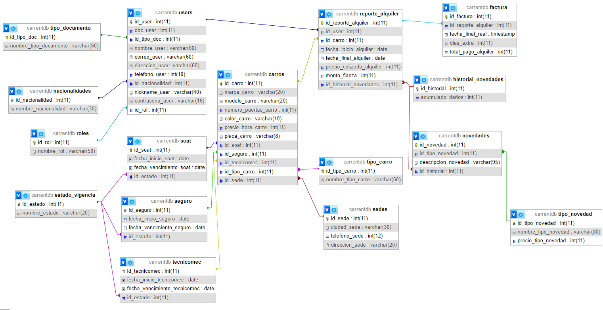

# CarRent

CarRent es un proyecto que tiene como objetivo desarrollar un sistema de gestión de alquiler de carros, proporcionando una plataforma eficiente y confiable para reservar vehículos para fechas específicas. El proyecto también busca facilitar el seguimiento de novedades relacionadas con los carros alquilados, como accidentes, daños o problemas mecánicos. A través de una base de datos sólida y funcionalidades especializadas, CarRent busca mejorar la experiencia de alquiler de carros y brindar un servicio de calidad a sus usuarios.

## Objetivo general:

Desarrollar un sistema de gestión de alquiler de carros que permita a los usuarios reservar vehículos para fechas específicas y brinde un seguimiento eficiente de las novedades ocurridas durante el período de alquiler.

## Objetivos específicos:

- Diseñar e implementar una base de datos relacional que almacene información sobre los carros disponibles, sus características, disponibilidad y estado.
- Desarrollar un sistema de reservas que permita a los usuarios seleccionar un carro disponible para una fecha y registrar los detalles de la reserva en la base de datos.
- Crear un mecanismo para registrar y rastrear las novedades relacionadas con los carros alquilados, como pinchazos de llantas, accidentes, daños en la carrocería, problemas mecánicos, etc.
- Implementar funcionalidades que permitan a los usuarios generar informes sobre las novedades ocurridas durante el período de alquiler, con detalles específicos de cada incidente.

## Estructura base de datos

Esta sería la estructura que tendría la base de datos para el proyecto.



## Requisitos

Antes de comenzar, asegúrate de tener instalado lo siguiente en tu máquina:

- Node.js: https://nodejs.org
- MySQL: https://www.mysql.com

Además de esto, es necesario mencionar que los paquetes usados fueron las siguientes:

- cookie-parser: Para el manejo de las cookies al momento de realizar la autenticación respectiva en cada ruta necesaria.
- dotenv: Para usar variables de entorno.
- express: Para realizar el montaje del servidor y de la api como tal.
- jose: Para el uso del Json Web Token (JWT).
- mysql2: Para poder hacer una conexión a nuestra base de datos.
- yup: Para el DTO, es decir, la validación en la transferencia de datos.

## Configuración

1.  Clona este repositorio en tu máquina local.
1.  Abre una terminal en la carpeta raíz del proyecto.
1.  Ejecuta el siguiente comando para instalar las dependencias necesarias:

        npm install

1.  Crea un archivo .env en la carpeta raíz del proyecto y agrega las siguientes variables de entorno:

        MY_CONFIG={"host":"localhost", "user":"root","database": NOMBRE_DB,"password":"", "port":3306}
        MY_SERVER={"hostname":"127.20.20.1", "port":5000}
        JWT_PRIVATE_KEY="PalabraSecreta"

    ###### Asegurate de cambiar NOMBRE_DB y demás configuraciones según tus necesidades

## Base de datos

Para obtener la base de datos, ejecuta el archivo `db.sql` que esta ubicado en la carpeta utils dentro de la carpeta src.

## Ejecución

Para ejecutar correctamente el servidor debes asegurarte de tener `nodemon`, ya teniendo esta dependencia, solo escribes en la consola:

        npm run dev

## Autorización

Para usar nuestra api debes tener en cuenta que no todos los usuarios tienen acceso a las ruta, solo aquel que tiene el rol de administrador (id:2), puede tener acceso completo a todas las rutas, los clientes (id:1), solo tendran acceso a una cantidad reducida de ellas.

Estos es posible gracias al uso de JWT y la autenticación de credenciales a través de una consulta a las tabla `users`.

Los pasos que usamos para crear todo lo anterior son los siguientes.

###### RECUERDA QUE LA IP DEL SERVIDOR SERÁ LA CORRESPONDIENTE EN EL ARCHIVO `.env` descrita en el `hostname`. Los valores de cada dato acontinuación son netamente ejemplos de lo que podrían contener los datos de entrada.

1.  El usuario (sea administrador o cliente) deberá logearse a través del siguiente endpoint

    - URL: `http://127.20.30.1:5005/api/post/login`
    - Método: `POST`
    - Datos de entrada (body):
      ```
        {
            "username":"admin",
            "password":"admin123"
        }
      ```
    - Datos de salida: Nos devolverá el token creado y guardado en un cookie llamada `User`

    **Es importante recalcar que en el ejemplo anterior se usó un user con rol de administración por lo que tendrá acceso a todas las rutas.**

2.  Luego de logearse, el usuario podrá empezar a consumir la api durante cierto tiempo. Nuestra api cuenta con un tiempo máximo de espera entre petición y petición de 10min, ya que cada vez que consumes un endpoint, te renovamos tu cookie por 10min, de pasarte de ese tiempo, deberás volver a logearte.

3.  Cada vez que haces una petición a una ruta, entra un middleware a validar el rol que tienes en nuestra base de datos, y según el rol te permite o no seguir con tu consulta.

4.  Supongamos que entraste con un usuario que tiene el rol de cliente. A las URL que no tengas permitidas tendrás un mensaje como el siguiente:

          "El usuario no tiene permitido usar esta ruta"

5.  Llegado el caso de que el usuario no tenga un registro en nuestra base de datos, podrá registrarse a través del endpoint descrito en el siguiente apartado donde hablamos de una situación hipotética.

## Situación hipotética

En esta situación hipotética pondremos un ejemplo en todo el proceso de alquiler de un carro

###### RECUERDA QUE LA IP DEL SERVIDOR SERÁ LA CORRESPONDIENTE EN EL ARCHIVO `.env` descrita en el `hostname`. Los valores de cada dato acontinuación son netamente ejemplos de lo que podrían contener los datos de entrada.

1.  Procederemos a la creación del respectivo cliente

    - URL: `http://127.20.30.1:5005/api/post/agregarUsuario`
    - Método: `POST`
    - Disponibilidad: Todos los roles.
    - Datos de entrada (body):
      ```
        {
            "Documento": 1000000,
            "IdTipoDocumento": 1,
            "Nombre": "Emily Nieves",
            "Correo": "emily@hotmail.com",
            "Direccion": "Calle 100",
            "Telefono": 31111111,
            "IdNacionalidad": 2,
            "Usuario": "emilynievesb",
            "Contraseña": "emilg",
            "IdRol": 1
        }
      ```
    - Datos de salida:

            "Usuario agregado correctamente"

###### Nuestro cliente quiere alquilar uno de nuestros vehículos, usaremos el siguiente endpoint para generar el reporte de alquiler

1.  Agregar reporte de alquiler

    - URL: `http://127.20.30.1:5005/api/post/agregarReporte`
    - Método: `POST`
    - Disponibilidad: Solo administrador.
    - Datos de entrada (body):

      ```
        {
            "IdUsuario": 2,
            "IdCarro": 2,
            "FechaInicio": "2023-10-02",
            "FechaDevolucion": "2023-10-05"
        }
      ```

    - Datos de salida:

            "Reporte de alquiler creado correctamente, con historial de novedades 39, para que pueda reportar cualquier novedad llegado el caso"

    - Este endpoint internamente está validando la disponibilidad del carro, si está disponible entonces calcula el precio de la cotización en base al cálculo del número de horas entre fecha y fecha, el valor de la hora que tiene el carro seleccionado y así mismo se saca el valor de la fianza tomando en cuenta el valor de la cotización. Y se crea de manera automática el historial donde iran las novedades necesarias.

    - Si llegado el caso, escogen un carro que no esté disponible en esa fecha la api responderá:

            "El carro no está disponible para esa fecha, por favor seleccione otro"

###### Si llegado el caso, el cliente se llegara a enfrentar con una situación en la que se presente un daño en el vehículo es necesario que se haga su debido registro con el siguiente endpoint

2.  Agregar novedad

    - URL: `http://127.20.30.1:5005/api/post/agregarNovedad`
    - Método: `POST`
    - Disponibilidad: Todos los roles.
    - Datos de entrada (body):

      ```
        {
            "IdTipoNovedad": 4,
            "Descripcion":"Se estrelló el carro en vía nacional",
            "IdHistorial":1
        }
      ```

    - Datos de salida:

            "Novedad creada correctamente, se agregaron $60,000 al recargo"

    - Este endpoint internamente está haciendo un autosumado al acumulado de daños. Es decir, cada vez que se agrega una nueva novedad, el acumulado de daños se va a autoincrementando, esto es posible gracias a una función actualizadora en el historial de novedades.

###### Después del uso del vehículo, se genera la factura de cobro con el siguiente endpoint

3.  Agregar factura

    - URL: `http://127.20.30.1:5005/api/post/agregarFactura`
    - Método: `POST`
    - Disponibilidad: Solo administrador.
    - Datos de entrada (body):

      ```
        {
            "IdReporte":3,
            "FechaEntregaCarro":"2023-10-20"
        }
      ```

    - Datos de salida:

            "Factura creada correctamente por valor $1,154,166"

    - Este endpoint internamente valida si ya existe una factura previa de este reporte, esto con el fin de evitar doble facturación. Además también, calcula los días extras que pueden ser posibles al entregar el vehículo posterior a la fecha inicialmente pactada, revisa la fianza entregada, el valor de los daños registrados y en base a todo esto, llega a un precio final creando así la factura.

    - Llegado el caso de que la factura ya exista, la api responderá:

            "Ya existe una factura para este alquiler"

## Endpoints de agregado de datos atómicos

Si llegado el caso los datos iniciales agregados en la base de datos, no son suficientes, podrás agregar más opciones con los siguientes endpoints:

###### RECUERDA QUE LA IP DEL SERVIDOR SERÁ LA CORRESPONDIENTE EN EL ARCHIVO `.env` descrita en el `hostname`. Los valores de cada dato acontinuación son netamente ejemplos de lo que podrían contener los datos de entrada.

_Algunos endpoints no están habilitados para todos los usuarios, por lo que se describirá en cada uno, cuales están abiertos para todos los roles, y cuales solamente para el administrador_

1.  Agregar carros

    - URL: `http://127.20.30.1:5005/api/post/agregarCarro`
    - Método: `POST`
    - Disponibilidad: Solo administrador.
    - Datos de entrada (body):
      ```
        {
            "Marca":"BMW",
            "Modelo":"X3",
            "NumeroPuertas":5,
            "Color":"Blanco perla",
            "Precioxhora":70000,
            "Placa":"ABC456",
            "IdSoat":2,
            "IdSeguro":3,
            "IdTecnicomecanica":4,
            "IdTipoCarro":2,
            "IdSede":3
        }
      ```
    - Datos de salida:

            "Carro agregado con exito"

1.  Agregar roles

    - URL: `http://127.20.30.1:5005/api/post/agregarRol`
    - Método: `POST`
    - Disponibilidad: Solo administrador.
    - Datos de entrada (body):
      ```
        {
            "Rol":"Empleado"
        }
      ```
    - Datos de salida:

            "Rol agregado correctamente"

1.  Agregar tipo de documento

    - URL: `http://127.20.30.1:5005/api/post/agregarTipoDocumento`
    - Método: `POST`
    - Disponibilidad: Solo administrador.
    - Datos de entrada (body):

      ```
        {
            "TipoDocumento":"Licencia de conducción"
        }
      ```

    - Datos de salida:

            "Tipo de documento agregado correctamente"

1.  Agregar nacionalidad

    - URL: `http://127.20.30.1:5005/api/post/agregarNacionalidad`
    - Método: `POST`
    - Disponibilidad: Solo administrador.
    - Datos de entrada (body):
      ```
        {
            "Nacionalidad":"Cubana"
        }
      ```
    - Datos de salida:

            "Nacionalidad agregada correctamente"

1.  Agregar estado de vigencia

    - URL: `http://127.20.30.1:5005/api/post/agregarEstadoVigencia`
    - Método: `POST`
    - Disponibilidad: Solo administrador.
    - Datos de entrada (body):
      ```
        {
            "EstadoVigencia":"Pronto a vencer"
        }
      ```
    - Datos de salida:

            "Estado agregado correctamente"

1.  Agregar soat

    - URL: `http://127.20.30.1:5005/api/post/agregarSoat`
    - Método: `POST`
    - Disponibilidad: Solo administrador.
    - Datos de entrada (body):

      ```
        {
            "FechaInicio": "2023-10-01",
            "FechaVencimiento": "2023-11-01",
            "IdEstado": 1
        }
      ```

    - Datos de salida:

            "Soat agregado correctamente"

1.  Agregar seguro

    - URL: `http://127.20.30.1:5005/api/post/agregarSeguro`
    - Método: `POST`
    - Disponibilidad: Solo administrador.
    - Datos de entrada (body):

      ```
        {
            "FechaInicio": "2023-10-01",
            "FechaVencimiento": "2023-11-01",
            "IdEstado": 1
        }
      ```

    - Datos de salida:

            "Seguro creado correctamente"

1.  Agregar tecnicomecanica

    - URL: `http://127.20.30.1:5005/api/post/agregarTecnicomec`
    - Método: `POST`
    - Disponibilidad: Solo administrador.
    - Datos de entrada (body):

      ```
        {
            "FechaInicio": "2023-10-01",
            "FechaVencimiento": "2023-11-01",
            "IdEstado": 1
        }
      ```

    - Datos de salida:

            "Tecnicomecanica creada correctamente"

1.  Agregar tipo de carro

    - URL: `http://127.20.30.1:5005/api/post/agregarTipoCarro`
    - Método: `POST`
    - Disponibilidad: Solo administrador.
    - Datos de entrada (body):

      ```
        {
            "Nombre": "Deportivo"
        }
      ```

    - Datos de salida:

            "Tipo de carro creado correctamente"

1.  Agregar tipo de novedad

    - URL: `http://127.20.30.1:5005/api/post/agregarTipoNovedad`
    - Método: `POST`
    - Disponibilidad: Solo administrador.
    - Datos de entrada (body):

      ```
        {
            "Nombre": "Puerta rayada",
            "Precio": 73000
        }
      ```

    - Datos de salida:

            "Tipo de novedad creada correctamente"

1.  Agregar sede

    - URL: `http://127.20.30.1:5005/api/post/agregarSede`
    - Método: `POST`
    - Disponibilidad: Solo administrador.
    - Datos de entrada (body):

      ```
        {
            "Ciudad": "Cali",
            "Telefono":602631025,
            "Dirección":"Calle 71 No. 32-22"
        }
      ```

    - Datos de salida:

            "Sede creada correctamente"

## Endpoints de obtención de data

###### RECUERDA QUE LA IP DEL SERVIDOR SERÁ LA CORRESPONDIENTE EN EL ARCHIVO `.env` descrita en el `hostname`. Los valores de cada dato acontinuación son netamente ejemplos de lo que podrían contener los datos de entrada.

_Algunos endpoints no están habilitados para todos los usuarios, por lo que se describirá en cada uno, cuales están abiertos para todos los roles, y cuales solamente para el administrador_

Para poder acceder a los datos registrados en la base de datos, usaremos los siguientes endpoints:

1.  Obtener todos los carros

    - URL: `http://127.20.30.1:5005/api/get/obtenerCarros`
    - Método: `GET`
    - Disponibilidad: Solo administrador.
    - Datos de entrada (query): Ninguno.
    - Datos de salida:

      ```
        [
            {
                "id": 1,
                "marca": "Toyota",
                "modelo": "Corolla",
                "numero_puertas": 4,
                "color": "Negro",
                "precio_hora": 50000,
                "placa": "ABC123",
                "tipo_carro": "Sedán",
                "ciudad": "Bogotá",
                "telefono": 1234567890,
                "direccion": "Calle 123 #45-67"
            },
            {
                "id": 3,
                "marca": "Chevrolet",
                "modelo": "Spark",
                "numero_puertas": 5,
                "color": "Blanco",
                "precio_hora": 40000,
                "placa": "GHI789",
                "tipo_carro": "SUV",
                "ciudad": "Bogotá",
                "telefono": 1234567890,
                "direccion": "Calle 123 #45-67"
            },
            {
                "id": 4,
                "marca": "Ford",
                "modelo": "Mustang",
                "numero_puertas": 2,
                "color": "Rojo",
                "precio_hora": 70000,
                "placa": "JKL012",
                "tipo_carro": "SUV",
                "ciudad": "Medellín",
                "telefono": 2147483647,
                "direccion": "Carrera 678 #12-34"
            },
        ]
      ```

1.  Obtener un carro por id

    - URL: `http://127.20.30.1:5005/api/get/obtenerCarro?idCarro=2`
    - Método: `GET`
    - Disponibilidad: Todos los roles.
    - Datos de entrada (query): idCarro, recuerda reemplazar el valor de idCarro por el id del carro que realmente necesitas.
    - Datos de salida:

      ```
          {
              "id": 2,
              "marca": "Honda",
              "modelo": "Civic",
              "numero_puertas": 4,
              "color": "Gris",
              "precio_hora": 45000,
              "placa": "DEF456",
              "tipo_carro": "Sedán",
              "ciudad": "Medellín",
              "telefono": 2147483647,
              "direccion": "Carrera 678 #12-34"
          }
      ```

1.  Obtener todos los estados de vigencia

    - URL: `http://127.20.30.1:5005/api/get/obtenerEstadosVigencia`
    - Método: `GET`
    - Disponibilidad: Solo administrador.
    - Datos de entrada (query): Ninguno.
    - Datos de salida:

      ```
        [
            {
                "id_estado": 1,
                "nombre_estado": "Vigente"
            },
            {
                "id_estado": 2,
                "nombre_estado": "Vencido"
            }
        ]
      ```

1.  Obtener todos las facturas

    - URL: `http://127.20.30.1:5005/api/get/obtenerFacturas`
    - Método: `GET`
    - Disponibilidad: Solo administrador.
    - Datos de entrada (query): Ninguno.
    - Datos de salida:

      ```
        [
            {
                "id": 1,
                "fecha_final": "2023-07-08T17:00:00.000Z",
                "dias_extra": 0,
                "total_pago": 350000,
                "fecha_inicio": "2023-07-01T05:00:00.000Z",
                "fecha_final_alquiler": "2023-07-08T05:00:00.000Z",
                "precio_cotizado": 350000,
                "monto_fianza": 200000,
                "acumulado_danos": 300000,
                "nombre_cliente": "Juan Pérez",
                "marca_carro": "Toyota",
                "modelo_carro": "Corolla",
                "ciudad_sede": "Bogotá"
            },
            {
                "id": 3,
                "fecha_final": "2023-07-13T14:15:00.000Z",
                "dias_extra": 0,
                "total_pago": 240000,
                "fecha_inicio": "2023-07-10T05:00:00.000Z",
                "fecha_final_alquiler": "2023-07-13T05:00:00.000Z",
                "precio_cotizado": 240000,
                "monto_fianza": 150000,
                "acumulado_danos": 300000,
                "nombre_cliente": "Carlos González",
                "marca_carro": "Chevrolet",
                "modelo_carro": "Spark",
                "ciudad_sede": "Bogotá"
            },
            {
                "id": 2,
                "fecha_final": "2023-07-09T15:30:00.000Z",
                "dias_extra": 1,
                "total_pago": 330000,
                "fecha_inicio": "2023-07-05T05:00:00.000Z",
                "fecha_final_alquiler": "2023-07-09T05:00:00.000Z",
                "precio_cotizado": 320000,
                "monto_fianza": 180000,
                "acumulado_danos": 150000,
                "nombre_cliente": "Jane Smith",
                "marca_carro": "Honda",
                "modelo_carro": "Civic",
                "ciudad_sede": "Medellín"
            }
        ]
      ```

1.  Obtener una factura por id

    - URL: `http://127.20.30.1:5005/api/get/obtenerFactura?idFactura=13`
    - Método: `GET`
    - Disponibilidad: Solo administrador.
    - Datos de entrada (query): idFactura, recuerda reemplazar el valor de idFactura por el id de la factura que realmente necesitas.
    - Datos de salida:

      ```
          {
              "id": 13,
              "fecha_final": "2023-07-14T05:00:00.000Z",
              "dias_extra": 9,
              "total_pago": 1154167,
              "fecha_inicio": "2023-07-20T05:00:00.000Z",
              "fecha_final_alquiler": "2023-07-23T05:00:00.000Z",
              "precio_cotizado": 270000,
              "monto_fianza": 150000,
              "acumulado_danos": 850000,
              "nombre_cliente": "Laura Fernández",
              "marca_carro": "Nissan",
              "modelo_carro": "Sentra",
              "ciudad_sede": "Cali"
          }
      ```

1.  Obtener todos los historiales de novedades

    - URL: `http://127.20.30.1:5005/api/get/obtenerHistorialesNovedades`
    - Método: `GET`
    - Disponibilidad: Solo administrador.
    - Datos de entrada (query): Ninguno.
    - Datos de salida:

      ```
        [
            {
              "id": 1,
              "acumulado_danos": 300000
            },
            {
              "id": 2,
              "acumulado_danos": 150000
            },
            {
              "id": 3,
              "acumulado_danos": 300000
            }
        ]
      ```

1.  Obtener todas las nacionalidades

    - URL: `http://127.20.30.1:5005/api/get/obtenerNacionalidades`
    - Método: `GET`
    - Disponibilidad: Solo administrador.
    - Datos de entrada (query): Ninguno.
    - Datos de salida:

      ```
        [
            {
                "id": 1,
                "nombre": "Colombia"
            },
            {
                "id": 2,
                "nombre": "Estados Unidos"
            },
            {
                "id": 3,
                "nombre": "España"
            },
            {
                "id": 4,
                "nombre": "Venezolana"
            }
        ]
      ```

1.  Obtener todas las novedades

    - URL: `http://127.20.30.1:5005/api/get/obtenerNovedades`
    - Método: `GET`
    - Disponibilidad: Solo administrador.
    - Datos de entrada (query): Ninguno.
    - Datos de salida:

      ```
        [
            {
                "id": 1,
                "tipo": "Rasguño pequeño",
                "descripcion": "Pequeño rasguño en la puerta izquierda.",
                "precio": 50000
            },
            {
                "id": 2,
                "tipo": "Abolladura",
                "descripcion": "Abolladura en la parte trasera del vehículo.",
                "precio": 80000
            },
            {
                "id": 3,
                "tipo": "Rotura de espejo",
                "descripcion": "Espejo lateral izquierdo roto.",
                "precio": 100000
            },
        ]
      ```

1.  Obtener una novedad por id

    - URL: `http://127.20.30.1:5005/api/get/obtenerNovedad?idNovedad=2`
    - Método: `GET`
    - Disponibilidad: Solo administrador.
    - Datos de entrada (query): idNovedad, recuerda reemplazar el valor de idNovedad por el id de la novedad que realmente necesitas.
    - Datos de salida:

      ```
          {
              "id": 2,
              "tipo": "Abolladura",
              "descripcion": "Abolladura en la parte trasera del vehículo.",
              "precio": 80000
          }
      ```

1.  Obtener todos los reportes

    - URL: `http://127.20.30.1:5005/api/get/obtenerReportes`
    - Método: `GET`
    - Disponibilidad: Solo administrador.
    - Datos de entrada (query): Ninguno.
    - Datos de salida:

      ```
      [
          {
              "id": 1,
              "nombre_usuario": "Juan Pérez",
              "placa_carro": "ABC123",
              "fecha_inicio": "2023-07-01T05:00:00.000Z",
              "fecha_final": "2023-07-08T05:00:00.000Z",
              "precio_cotizado": 350000,
              "monto_fianza": 200000
          },
          {
              "id": 2,
              "nombre_usuario": "Jane Smith",
              "placa_carro": "DEF456",
              "fecha_inicio": "2023-07-05T05:00:00.000Z",
              "fecha_final": "2023-07-09T05:00:00.000Z",
              "precio_cotizado": 320000,
              "monto_fianza": 180000
          },
          {
              "id": 3,
              "nombre_usuario": "Carlos González",
              "placa_carro": "GHI789",
              "fecha_inicio": "2023-07-10T05:00:00.000Z",
              "fecha_final": "2023-07-13T05:00:00.000Z",
              "precio_cotizado": 240000,
              "monto_fianza": 150000
          }
      ]
      ```

1.  Obtener un reporte por id

    - URL: `http://127.20.30.1:5005/api/get/obtenerReporte?idReporte=2`
    - Método: `GET`
    - Disponibilidad: Solo administrador.
    - Datos de entrada (query): idReporte, recuerda reemplazar el valor de idReporte por el id del reporte que realmente necesitas.
    - Datos de salida:

      ```
          {
              "id": 2,
              "nombre_usuario": "Jane Smith",
              "placa_carro": "DEF456",
              "fecha_inicio": "2023-07-05T05:00:00.000Z",
              "fecha_final": "2023-07-09T05:00:00.000Z",
              "precio_cotizado": 320000,
              "monto_fianza": 180000
          }
      ```

1.  Obtener todos los roles

    - URL: `http://127.20.30.1:5005/api/get/obtenerRoles`
    - Método: `GET`
    - Disponibilidad: Solo administrador.
    - Datos de entrada (query): Ninguno.
    - Datos de salida:

      ```
        [
            {
                "id": 1,
                "nombre": "Cliente"
            },
            {
                "id": 2,
                "nombre": "Administrador"
            }
        ]
      ```

1.  Obtener todas las sedes

    - URL: `http://127.20.30.1:5005/api/get/obtenerSedes`
    - Método: `GET`
    - Disponibilidad: Solo administrador.
    - Datos de entrada (query): Ninguno.
    - Datos de salida:

      ```
        [
            {
            "id": 1,
            "ciudad": "Bogotá",
            "telefono": 1234567890,
            "direccion": "Calle 123 #45-67"
            },
            {
            "id": 2,
            "ciudad": "Medellín",
            "telefono": 2147483647,
            "direccion": "Carrera 678 #12-34"
            },
            {
            "id": 3,
            "ciudad": "Cali",
            "telefono": 2147483647,
            "direccion": "Avenida 987 #56-78"
            }
        ]
      ```

1.  Obtener todos los seguros

    - URL: `http://127.20.30.1:5005/api/get/obtenerSeguros`
    - Método: `GET`
    - Disponibilidad: Solo administrador.
    - Datos de entrada (query): Ninguno.
    - Datos de salida:

      ```
      [
          {
              "id": 1,
              "fecha_inicio": "2023-01-01T05:00:00.000Z",
              "fecha_vencimiento": "2024-01-01T05:00:00.000Z",
              "estado": "Vigente"
          },
          {
              "id": 2,
              "fecha_inicio": "2023-02-15T05:00:00.000Z",
              "fecha_vencimiento": "2024-02-15T05:00:00.000Z",
              "estado": "Vigente"
          }
      ]
      ```

1.  Obtener todos los soat

    - URL: `http://127.20.30.1:5005/api/get/obtenerSoats`
    - Método: `GET`
    - Disponibilidad: Solo administrador.
    - Datos de entrada (query): Ninguno.
    - Datos de salida:

          ```

              [
                {
                    "id": 1,
                    "fecha_inicio": "2023-01-01T05:00:00.000Z",
                    "fecha_vencimiento": "2024-01-01T05:00:00.000Z",
                    "estado": "Vigente"
                },
                {
                    "id": 2,
                    "fecha_inicio": "2023-02-15T05:00:00.000Z",
                    "fecha_vencimiento": "2024-02-15T05:00:00.000Z",
                    "estado": "Vigente"
                }
              ]
              ```

1.  Obtener todas las tecnicomecanicas

    - URL: `http://127.20.30.1:5005/api/get/obtenerTecnicomec`
    - Método: `GET`
    - Disponibilidad: Solo administrador.
    - Datos de entrada (query): Ninguno.
    - Datos de salida:

      ```
      [
          {
              "id": 1,
              "fecha_inicio": "2023-01-01T05:00:00.000Z",
              "fecha_vencimiento": "2024-01-01T05:00:00.000Z",
              "estado": "Vigente"
          },
          {
              "id": 2,
              "fecha_inicio": "2023-02-15T05:00:00.000Z",
              "fecha_vencimiento": "2024-02-15T05:00:00.000Z",
              "estado": "Vigente"
          }
      ]
      ```

1.  Obtener todos los tipos de carro

    - URL: `http://127.20.30.1:5005/api/get/obtenerRoles`
    - Método: `GET`
    - Disponibilidad: Solo administrador.
    - Datos de entrada (query): Ninguno.
    - Datos de salida:

      ```
        [
            {
                "id": 1,
                "nombre": "Sedán"
            },
            {
                "id": 2,
                "nombre": "SUV"
            },
            {
                "id": 3,
                "nombre": "Camioneta"
            },
            {
                "id": 4,
                "nombre": "Deportivo"
            }
        ]
      ```

1.  Obtener todos los tipos de documento

    - URL: `http://127.20.30.1:5005/api/get/obtenerTiposDoc`
    - Método: `GET`
    - Disponibilidad: Solo administrador.
    - Datos de entrada (query): Ninguno.
    - Datos de salida:

      ```
        [
            {
                "id": 1,
                "nombre": "Cédula de ciudadanía"
            },
            {
                "id": 2,
                "nombre": "Pasaporte"
            },
            {
                "id": 3,
                "nombre": "Cédula de extranjería"
            }
        ]
      ```

1.  Obtener todos los tipos de novedad

    - URL: `http://127.20.30.1:5005/api/get/obtenerTiposNovedad`
    - Método: `GET`
    - Disponibilidad: Solo administrador.
    - Datos de entrada (query): Ninguno.
    - Datos de salida:

      ```
        [
            {
                "id": 1,
                "nombre": "Rasguño pequeño",
                "precio": 50000
            },
            {
                "id": 2,
                "nombre": "Abolladura",
                "precio": 80000
            },
            {
                "id": 3,
                "nombre": "Rotura de espejo",
                "precio": 100000
            },
            {
                "id": 4,
                "nombre": "Daño en llanta",
                "precio": 60000
            }
        ]
      ```

1.  Obtener todos los usuarios

    - URL: `http://127.20.30.1:5005/api/get/obtenerUsuarios`
    - Método: `GET`
    - Disponibilidad: Solo administrador.
    - Datos de entrada (query): Ninguno.
    - Datos de salida:

      ```
        [
            {
                "id": 1,
                "documento": 12345678,
                "tipo_documento": "Cédula de ciudadanía",
                "nombre": "Juan Pérez",
                "correo": "juan@example.com",
                "direccion": "Calle 123 #45-67",
                "telefono": 2147483647,
                "nacionalidad": "Colombia",
                "nickname": "juan123",
                "rol": "Cliente"
            },
            {
                "id": 2,
                "documento": 98765432,
                "tipo_documento": "Pasaporte",
                "nombre": "Jane Smith",
                "correo": "jane@example.com",
                "direccion": "Avenue 456 #78-90",
                "telefono": 2147483647,
                "nacionalidad": "Estados Unidos",
                "nickname": "jane456",
                "rol": "Cliente"
            },
            {
                "id": 3,
                "documento": 87654321,
                "tipo_documento": "Cédula de ciudadanía",
                "nombre": "Carlos González",
                "correo": "carlos@example.com",
                "direccion": "Carrera 789 #12-34",
                "telefono": 2008765432,
                "nacionalidad": "Colombia",
                "nickname": "carlos77",
                "rol": "Cliente"
            }
        ]
      ```

1.  Obtener un usuario por id

    - URL: `http://127.20.30.1:5005/api/get/obtenerUsuario?idUsuario=8`
    - Método: `GET`
    - Disponibilidad: Solo administrador.
    - Datos de entrada (query): idUsuario, recuerda reemplazar el valor de idUsuario por el id del usuario que realmente necesitas.
    - Datos de salida:

      ```
        {
            "id": 8,
            "documento": 1000000,
            "tipo_documento": "Cédula de ciudadanía",
            "nombre": "Emily Nieves",
            "correo": "emily@hotmail.com",
            "direccion": "Calle 100",
            "telefono": 31111111,
            "nacionalidad": "Estados Unidos",
            "nickname": "emilynievesb",
            "rol": "Cliente"
        }
      ```

## DTO con YUP

## Validación de datos (DTO)

- Se realizó la validación de datos a través de la librería `YUP`. La librería Yup permite definir un esquema que describe la forma en que los datos deben ser validados.

- Al utilizar Yup para los DTO, puedes definir un esquema que especifique las reglas de validación que se deben aplicar a cada campo del DTO. Estas reglas pueden incluir validaciones como requerido, tipo de dato, longitud mínima o máxima, formato específico, entre otros.

- Un ejemplo de uno de los esquemas que se pueden crear es este:

  ```
  const addProductValidator = async (req, res, next) => {
    try {
      const productSchema = object({
        nombre: string()
          .strict()
          .matches(/^[a-z A-Z]+$/, "Is not in correct format")
          .required(),
        descripcion: string().optional(),
        estado: number().max(1).required(),
        created_by: number().nullable().optional(),
        update_by: number().nullable().optional(),
        created_at: date().nullable().optional(),
        updated_at: date().nullable().optional(),
        deleted_at: date().nullable().optional(),
      });
      await productSchema.validate(req.body);
      next();
    } catch (error) {
      res.status(400).json({ status: "fail", message: error.errors });
    }
  };
  ```

- Se creó un middleware, donde se valida la composición de los datos dentro de la request. Se instancia un objeto que describe el esquema de la request y se valida el body o el query según lo escrito en el esquema. El `validate()` es una promesa que generas una excepción en caso de no pasar la validación, y dentro del catch se hace la validación de excepciones, respondiendo un status `400` y un mensaje de error. Si la request sale OK, se ejecuta un `next`, que le avisa a express de debe ejecutar el siguiente middleware (en este caso, el endpoint o servicio que genera y responde a una consulta).

### Autora: Emily Nieves
